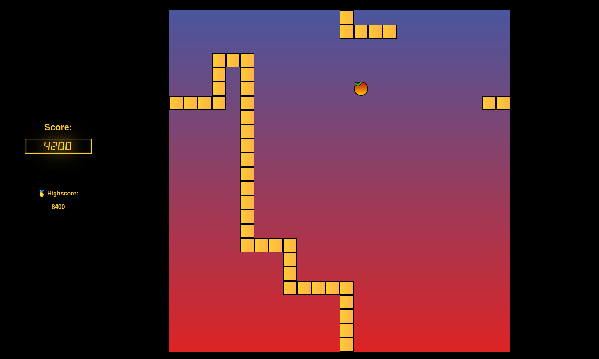

# Ironic Snake 🐉 

### The classic video game in a new look
A 2D game for the browser. Snake is a video game genre where the player maneuvers a growing line that becomes a primary obstacle to itself.

**Demo: [Play the Game!](https://julianbethge.github.io/ironic-snake/)**

### Screenshot

### Instructions
- Control the Snake: Use the arrow keys ⬅️⬆️⬇️➡️ or **WASD**
- Eat fruits to grow: 🍎
- And don't bite yourself... 🪦
- Good Luck!

### About the Author
- 👨‍💻 [Julian Bethge](https://www.linkedin.com/in/julian-bethge/)
- 🎓 Bachelor of Science in Media Informatics
- 💻 Full Stack Web Developer (Remote)
- 📍 Homebase: Berlin

### Facts & Features
- The player can wrap around the screen edges
- Score Display
- Highscore (local)
- Written in JS, CSS and HTML
- Sound Effects by 
    - [UNIVERSFIELD](https://pixabay.com/de/users/universfield-28281460/?utm_source=link-attribution&utm_medium=referral&utm_campaign=music&utm_content=117724) from [Pixabay](https://pixabay.com//?utm_source=link-attribution&utm_medium=referral&utm_campaign=music&utm_content=117724)
    - [Luca Di Alessandro](https://pixabay.com/users/lucadialessandro-25927643/?utm_source=link-attribution&utm_medium=referral&utm_campaign=music&utm_content=159024) from [Pixabay](https://pixabay.com//?utm_source=link-attribution&utm_medium=referral&utm_campaign=music&utm_content=159024)

#### Change Log
**2025/01/25**:
- Enhanced Menu Buttons:  
    - Buttons now change color and size when hovered over.  
    - Added visual feedback for button clicks with a distinct gradient and slight scaling effect.  

**2024/04/10**: 
- Improved settings menu for sound volume: 
    - Auditory feedback for the volume slider
    - Volume can be changed during a game (during pause)
- Added Pausing Function:
    - With escape you can now pause the Game and continue