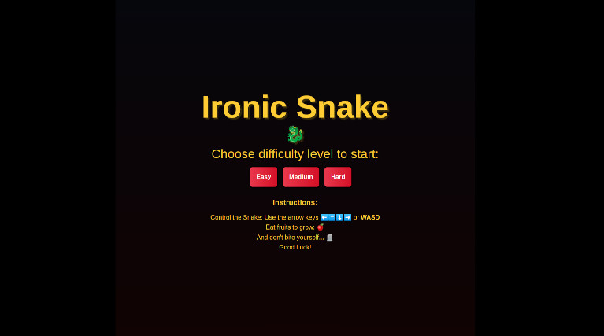

# Ironic Snake 🐉 

### The classic video game in a new look

A 2D game for the browser. Snake is a video game genre where the player maneuvers a growing line that becomes a primary obstacle to itself.

**Demo: [Play the Game!](https://julianbrandon.github.io/ironic-snake/)**

### Features
- Score Display
- Highscore (local)
- Three difficulty levels

### Screenshots

### Instructions

Control the Snake: Use the arrow keys ⬅️⬆️⬇️➡️ or **WASD**
Eat fruits to grow: 🍎
And don't bite yourself... 🪦
Good Luck!

### Technologys used
- HTML
- Javascript
- CSS

### About the Author
Julian Bethge
Homebase: Berlin
Full Stack Web Developer (remote)
Bachelor of Science Media Informatics
Contact: <julbethge@gmail.com>
LinkedIn: *coming soon*

